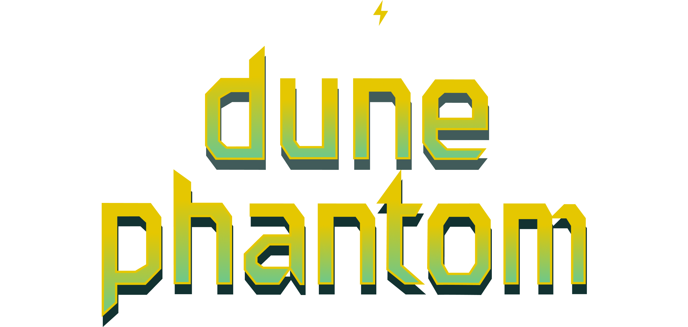
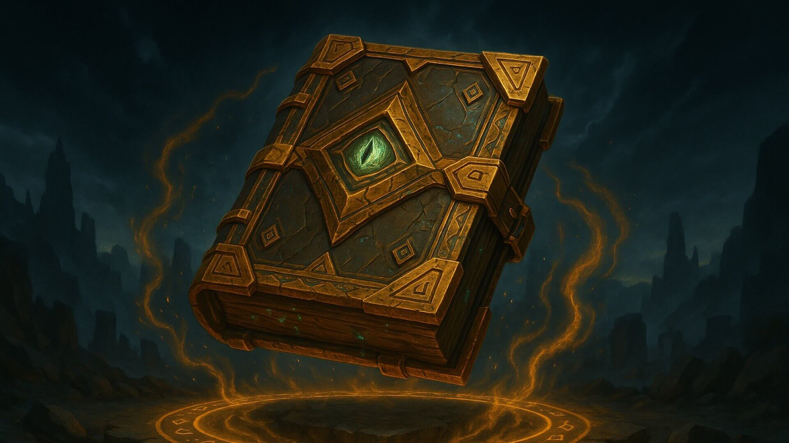
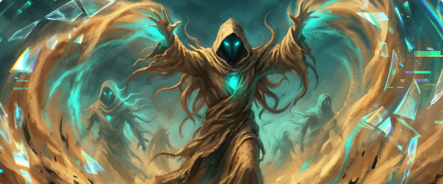

<div align="center">
  
  <h1>Dune Phantom — OffSec Challenge Solutions 🏜️</h1>
  <h3>Ember Expanse · Season 1 · Proving Grounds: The Gauntlet</h3>

  [](#)
  [](#)
  [](#)
</div>

---

Welcome to my writeup repository for the **OffSec Dune Phantom** challenge series. This repo collects investigation reports, diagrams, and supporting analysis for the weekly labs in "Proving Grounds: The Gauntlet".

---

## 📖 About Dune Phantom

> *"The Ember Expanse has always been harsh, but it has never been uncertain. That is changing as a phantom begins stalking the sands with mirage-like cyber attacks that twist what defenders trust most, the truth in their system data."*

<div align="center">
  <video src="./assets/dune-phantom-background-video.webm" width="100%" autoplay loop muted controls></video>
</div>

Dune Phantom is a defensive lab season focused on separating signal from illusion. Each week increases the pressure: first log analysis, then cloud incident response, and finally correlating evidence across systems to reconstruct a complete attack chain.

---

## 📂 Challenge Solutions

### ✅ [Week 0 — Tutorial Challenge](./WEEK%200%20-%20Tutorial%20Challenge)



**Status:** COMPLETED  |  **Category:** Log Analysis / Path Traversal  |  **Difficulty:** Easy

**Scenario:** Introductory lab for the Dune Phantom format. The task is to analyze a web server access log, understand the answer style, and identify a directory traversal attack that exposed an SSH private key.

**Key Skills:**
- Web server log analysis
- Path traversal detection
- Evidence extraction and answer validation

**Key Findings:**
- Attacker IP: `192.168.1.101`
- Exfiltrated secret: `/home/dave/.ssh/id_rsa`
- Result: HTTP 200 with 1,678 bytes exfiltrated

**Files:**
- [Investigation Report](./WEEK%200%20-%20Tutorial%20Challenge/INVESTIGATION_REPORT.md)

---

### ✅ [Week 1 — First Illusion](./WEEK%201%20-%20First%20Illusion)


**Status:** COMPLETED  |  **Category:** Cloud Incident Response / AWS Forensics / CI/CD Security  |  **Difficulty:** Easy

**Scenario:** EduNexus Learning Systems suffered a multi-stage cloud account takeover. The attacker found a leaked GitLab Personal Access Token in an exposed `.git/config`, used GitLab and CI/CD abuse to steal AWS credentials, pivoted through SSM and STS, then encrypted S3 data with SSE-C and locked defenders out.

**Key Skills:**
- AWS CloudTrail management and S3 data event analysis
- GitLab API and Nginx access log correlation
- EC2 Systems Manager (SSM) agent log forensics
- IAM trust relationship and AssumeRole chain mapping
- S3 SSE-C abuse detection

**Key Findings:**
- `ffuf/2.1.0-dev` used to discover the exposed `.git/config`
- Emily Johnson's GitLab PAT (Token ID 2, User ID 12) leaked through the config
- Malicious branch `xvduapqweksk` triggered CI/CD credential theft from IMDSv2
- SSM `SendCommand` injected SSH persistence on the bastion host
- IAM chain: `GitLabRunner` → `bastion` → `Ops_t1` → `Ops_t2` → `DevOps_full`
- S3 objects rewritten with `PutObject` + SSE-C (MITRE ATT&CK T1486)
- Defenders were locked out via `DeleteAccessKey` and `DeleteLoginProfile`

**Files:**
- [Investigation Report](./WEEK%201%20-%20First%20Illusion/INVESTIGATION_REPORT.md)



### 🔮 The Mirage Begins

> By correlating logs across multiple systems, you were able to track the attacker's steps and uncover what they did, but the method used to encrypt the data is not easily reversible. One detail stands apart from the rest: a deliberate signature left by the intruder, a message reading, "What you trusted was the first illusion. - Dune Phantom"

> The Dune Phantom is not after ransom alone. It twists forgotten tokens, trusted automation, impersonated roles, and unquestioned logs into mirages. At EduNexus, the corrupted data was only the visible wound; the real goal was to make truth unreliable and leave defenders doubting their tools, their evidence, and each other.

---

## 📊 Progress Tracker

| # | Challenge | Status | Focus | Difficulty | Score |
|---|---|---|---|---|---|
| 0 | Tutorial Challenge | ✅ Completed | Log Analysis / Path Traversal | Easy | 50/50 |
| 1 | First Illusion | ✅ Completed | Cloud IR / AWS Forensics / CI/CD Security | Easy | 5/5 |

---

## 🎯 Learning Objectives

Through these challenges, I’m building practical skills in:

- Incident response and investigation workflow
- Digital forensics and evidence correlation
- Cloud log analysis and control-plane / data-plane separation
- CI/CD abuse and GitLab API investigation
- IAM role chaining and trust policy analysis
- SSM / bastion host activity tracing
- S3 SSE-C abuse detection and impact analysis
- Writing clear defensive writeups with screenshots, diagrams, and evidence

---

## 🛠️ Tools & Technologies

- Log analysis: Python, regular expressions, JSON parsing
- Cloud forensics: AWS CloudTrail, S3 data events, STS activity
- Web investigation: GitLab API correlation, Nginx access logs
- OS forensics: SSM agent logs, audit logs, system logs
- Visualization: ASCII diagrams, Markdown, screenshots
- Reference tools: Wireshark, tshark, jq, Python scripting

---

## 🏆 Achievements

- ✅ Reconstructed the full attack chain from public S3 exposure to S3 encryption impact
- ✅ Identified the PAT leak, CI/CD abuse, SSM persistence, and IAM hop chain
- ✅ Built a corrected evidence-driven ASCII flowchart for Week 1
- ✅ Documented both challenges with investigation reports and supporting artifacts

---

## 📝 Repository Structure

```
dune phantom/
├── README.md
├── assets/
│   ├── dune-phantom-logo.png
│   ├── dune-phantom-background-video.webm
│   ├── tutorial.jpg
│   ├── first-illusion.jpg
│   └── first-illusion-conclusion.jpg
├── WEEK 0 - Tutorial Challenge/
│   └── INVESTIGATION_REPORT.md
└── WEEK 1 - First Illusion/
    ├── INVESTIGATION_REPORT.md
    └── attack_chain_diagram.png
```

---

## 🚀 Quick Start

```bash
git clone <your-repo-url>
cd "dune phantom"
```

To read a specific challenge:

```bash
cd "WEEK 0 - Tutorial Challenge"
# or
cd "WEEK 1 - First Illusion"
```

Then open `README.md` and `INVESTIGATION_REPORT.md` in that week folder for the full writeup.

---

## 📚 Learning Resources

- [OffSec](https://www.offsec.com/) — challenge platform and lab ecosystem
- [MITRE ATT&CK](https://attack.mitre.org/) — technique mapping
- [OWASP Web Security Testing Guide](https://owasp.org/www-project-web-security-testing-guide/) — web investigation reference
- [AWS CloudTrail Documentation](https://docs.aws.amazon.com/awscloudtrail/latest/userguide/cloudtrail-user-guide.html)
- [GitLab API Documentation](https://docs.gitlab.com/ee/api/)
- [Wireshark Documentation](https://www.wireshark.org/docs/)

---

## 🤝 Connect

- GitHub: [@umair-aziz025](https://github.com/umair-aziz025)
- Repository: `dune phantom`

---

## 📄 License

This repository is for educational purposes only. Challenge scenarios belong to OffSec. The writeups and analysis here are my own work.

---

## ⭐ Star This Repo

If you find these writeups useful, consider starring the repository.

---

Last Updated: May 29, 2026
